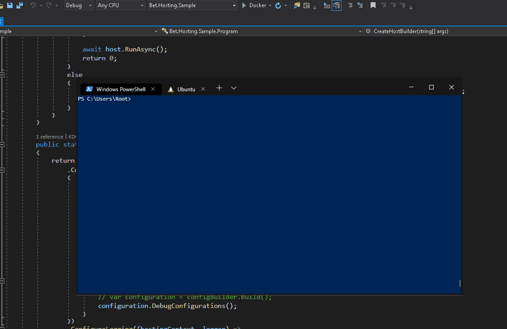

# AppAuthentication Cli Tool

[](https://ci.appveyor.com/project/kdcllc/bet-aspnetcore)
[](https://www.nuget.org/packages?q=appauthentication)



This dotnet cli tool provides ability to accesses Azure Vault in Docker Container when this container is ran on the local machine.
In addition if needed this cli tool can be enabled to retrieve tokens for local machine development.
It can be utilized in conjunction with VSCode Remote Extensions.

The tool was tested on:

- On Windows 10 Visual Studio.NET or AzureCli Providers.

- On Linux with Azure Cli only. Install Azure Cli `curl -sL https://aka.ms/InstallAzureCLIDeb | sudo bash`

```bash
    dotnet tool install --global appauthentication
```

## Usage with Local Docker development

1. Update `Docker-Compose.yml`

Before running this cli tool please make sure that the docker-compose file for the project has the environment variables

```yml
    MSI_ENDPOINT={MSI_ENDPOINT}
    MSI_SECRET={MSI_SECRET}
```

This can be done via `docker-compose.override.yml` like so:

```yml

    environment:
      - MSI_ENDPOINT=${MSI_ENDPOINT}
      - MSI_SECRET=${MSI_SECRET}
```

2. Install dotnet cli `appauthentication` tool

```cmd
    dotnet tool install --global appauthentication
```

Notes:

- Make sure that all of the existing `Containers` and `Images` are removed from the system as well.

- Go to Tools --> Options --> Azure Service Authentication --> Account Selection and Select the account that will be used for authenticating with your company's Azure Vault.

- Retrieve Azure AD Directory Id by navigating to [Azure Portal](https://portal.azure.com/#blade/Microsoft_AAD_IAM/ActiveDirectoryMenuBlade/Properties)

- Run this CLI tool with the following sample command:

`Default provider is AzureCli provider`

```bash
    appauthentication run -a  https://login.microsoftonline.com/{companyDirectoryGuidId} -v

    #or

    appauthentication run -a  {companyDirectoryGuidId} -v


    #or azure cli

    appauthentication run -a  {companyDirectoryGuidId} -v --token-provider VisualStudio

```

If AzureCli provider is used please make sure you log into Azure with the following commands:

```bash
    az login
    az account list
    az account set –subscription “YourSubscriptionName”
```

- Now you are ready to run your docker container locally and use Azure Vault.

## Tools possible switches

- --authority:authid or -a:authid
- --verbose:debug
- --token-provider:AzureCli or -t:VisualStudio (default VisualStudio)
- --environment:Production  or -e:Development
- --resource:test or -r:someresource
- --port:1010 or -p:2323
- --config:file or -c:appsettings.config
- --fix or -f
- --local or -l (default Docker)


## Testing from CLI

```bash
    dotnet run run --- -verbose:debug
```

## Reference

- Using without 2.2 `ENV DOTNET_ROLL_FORWARD_ON_NO_CANDIDATE_FX=2`

- To learn how to use this tool in real life example refer to [K8.DotNetCore.Workshop](https://github.com/kdcllc/K8.DotNetCore.Workshop).