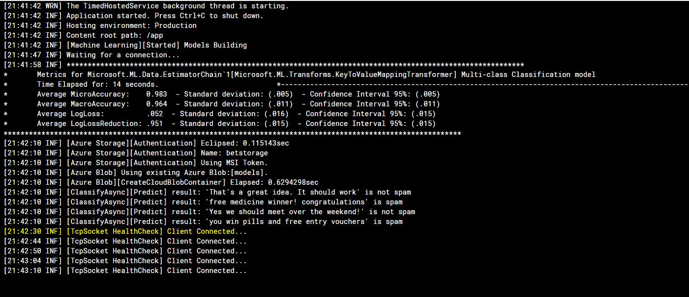

# .NET Core Service Worker for Machine Learning (ML.NET) Model Building

> The second letter in the Hebrew alphabet is the ב bet/beit. Its meaning is "house". In the ancient pictographic Hebrew it was a symbol resembling a tent on a landscape.

[](https://www.buymeacoffee.com/vyve0og)

## Give a Star! :star:

If you like or are using this project to learn or start your solution, please give it a star. Thanks!

## Summary

This example demonstrates how to schedule Machine Learning Model building process for Spam and Sentiment ML.NET models.

The idea is that ML.NET model is not stale and would have the input of a new `datapoints` and would require the rebuild of the model at the eve of each day.

The sample was designed to be run Kubernetes Cluster in two ways:

1. As `.NET Core Worker` (this would require a consistent memory allocation). This also demonstrates `worker` tcp based health check for the pod. The schedule is based on CronScheduler.


2. As a Cron Job (preferred usage). The execution schedule is based on Kubernetes

This sample is fully containerized to be used as:

1. As stand-alone Docker container that runs application every 30 min interval. It utilizes `TcpListener` for Pod health checks.
2. As [Kubernetes CronJob](https://kubernetes.io/docs/concepts/workloads/controllers/cron-jobs/) with interval specified in the deployment which is once a day at 1:00am.

## Azure

- Azure Blob storage has to have permission for MSI access as `Storage Blob Data Contributor`

## Build and Deploy

Testing K8 Cron Job in the local cluster please follow the setup instruction per [K8.DotNetCore.Workshop](https://github.com/kdcllc/K8.DotNetCore.Workshop).

Make sure to execute all of the commands from the solution folder.

1. Build the Image

```bash
    # builds and runs the container
    docker-compose -f "docker-compose.yml" -f "docker-compose.override.yml" up -d bet.hosting

    # simply builds the image
    docker-compose -f "docker-compose.yml" up -d --build --no-recreate bet.hosting

    # publish if needed
    docker push kdcllc/bet:hosting
```

2. Helm Install

```bash

    # install cron job
    helm install betcronjob k8s/bethosting/charts/betcronjob --set aadpodidbinding=[msiId],local.enabled=false

    # delete cron job
    helm uninstall  betcronjob

    # install worker pod
    helm install  betworker k8s/bethosting/charts/betworker --set aadpodidbinding=[msiId],local.enabled=false

    # delete worker deployment
    helm uninstall  betworker
```

Or

3. Install with Kubernetes

Installing simple yaml deployment for cron job:

```yaml
# https://kubernetes.io/docs/tasks/job/automated-tasks-with-cron-jobs/
apiVersion: batch/v1beta1
kind: CronJob
metadata:
  name: mlmodelbuilder-job
spec:
  schedule: "*/5 * * * *"
  concurrencyPolicy: Forbid
  successfulJobsHistoryLimit: 1
  failedJobsHistoryLimit: 2
  jobTemplate:
    spec:
      template:
        spec:
          containers:
          - name: mlmodelbuilder-job
            image: kdcllc/bet:hosting
            command: ["./Bet.Hosting.Sample"]
            env:
              - name: MSI_ENDPOINT
                value: http://host.docker.internal:5050/oauth2/token
              - name: MSI_SECRET
                value: 1c791bd8-94e7-468f-97f3-4b46a1d0aea5
            args:
            - "--runAsCronJob=true"
          restartPolicy: OnFailure
```

- Install `kubectl apply -f "cronjob.yaml"`

- Remove `kubectl delete -f "cronjob.yaml"`

## Hosting

- `RunConsoleAsync` – Enables console support
- `UseConsoleLifetime` – Listens for shutdown signals
